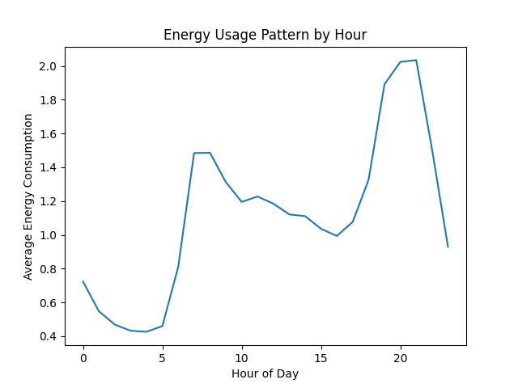

AI-Based Energy Consumption Forecasting & Optimization

Problem Statement

Energy consumption is often inefficient due to poor usage patterns and lack of predictive insights.
This project uses AI to forecast energy usage and identify optimization opportunities.

 
Approach

* Cleaned and processed real-world household energy dataset
* Engineered time-based features (hour, day, month)
* Built a Random Forest machine learning model
* Analyzed consumption patterns to extract actionable insights

Model Used

* Random Forest Regressor
* Evaluation Metric: Mean Absolute Error (MAE)

Key Insights

* Peak energy consumption occurs during evening hours
* Significant variation between peak and off-peak usage
* Load shifting can reduce energy usage by approximately **10–15%**

Business Impact

* Enables smarter energy usage decisions
* Helps reduce operational costs
* Supports sustainability and ESG goals

Tech Stack

* Python
* Pandas, NumPy
* Scikit-learn
* Matplotlib

Visualization

Conclusion

This project demonstrates how AI can be applied to real-world sustainability challenges by combining predictive modeling with business insights.
